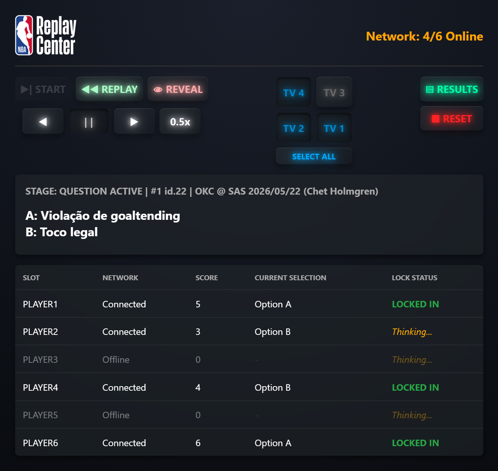
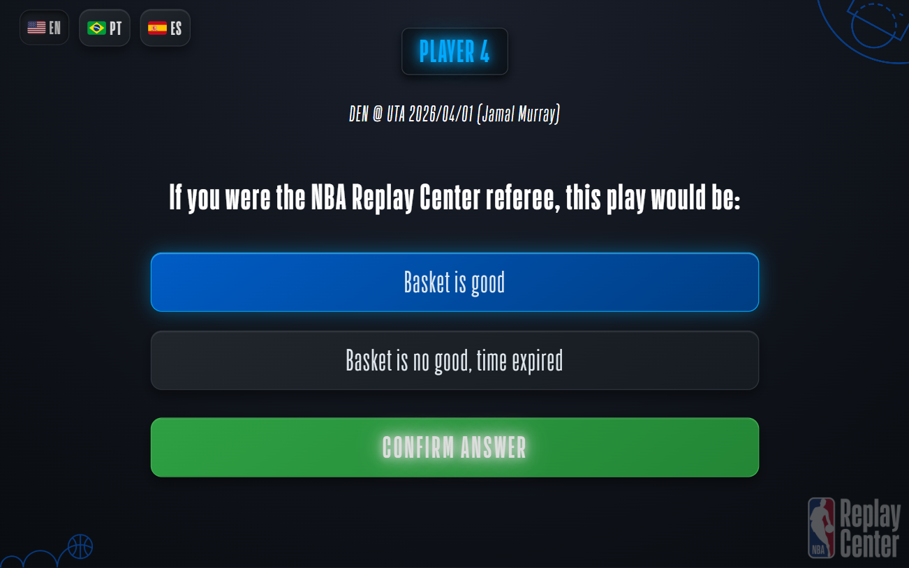
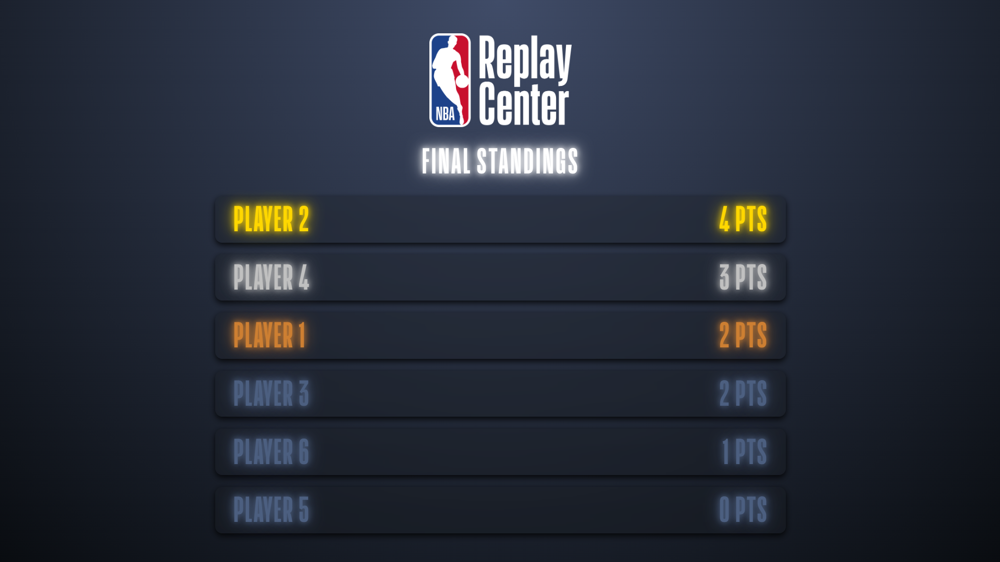
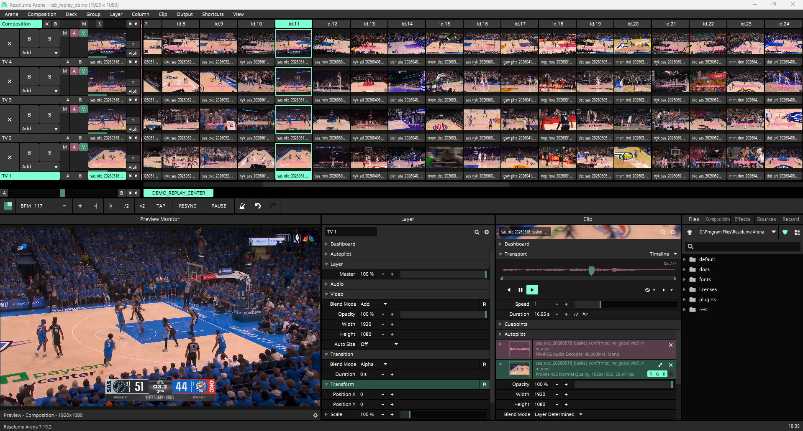

# NBA Park - Replay Center Game

Quiz-like game with playback controls for the Replay Center attraction in the NBA Park Gramado.
It synchronizes 6 player clients, an operator and debug console, a leaderboard screen, and 4 video playback feeds running on Resolume Arena via OSC messages.

## System
* **Backend - [`server.py`](./server.py):** State machine using Python, FastAPI, and Socket.IO. Handles game logic and fires UDP/OSC commands to video software.
* **Operator Console - [`admin.html`](./admin.html), [`admin.js`](./static/admin.js):** Control interface for the game flow (next question, reveal answer, reset, etc.), video transport (play, pause, reverse, speed), and 2x2 TV layer routing, while also providing state information (player score and actions, current stage, question info, etc.).
* **Player - [`player.html`](./player.html), [`player.js`](./static/player.js):** Stateless UI for players to read questions and info, select options, and confirm them.
* **Leaderboard - [`leaderboard.html`](./leaderboard.html), [`leaderboard.js`](./static/leaderboard.js):** Scoreboard output generated each time a game session ends.
* **Resolume Integration:** Sends OSC commands to local Resolume Arena instance (`127.0.0.1:7000`) to trigger columns, route video layers, adjust speed multipliers, and clip transport actions.

## Screenshots
### Operator Console Screen (full size)


### Player Screen (960x600)


### Leaderboard Screen (1920x1080)


### Resolume Arena Composition 


## Network
Once running, the interfaces are accessed via the server's local IP address and port (e.g., `http://192.168.1.100:8090`) followed by the role (`/admin`, `/player1`-`/player6`, `/leaderboard`, `/debug`). The **Debug Console** displays raw dumps of the server's private and shared state memory in real time.

## Resolume Composition OSC Mapping
The server communicates with Resolume Arena over UDP port 7000 using the address structure:
* **TV Routing:** *TV1 -> Layer 1*, and so on (4 different camera angle clips for each play).
* **Trigger Question / Stage Column:** `/composition/columns/{col}/connect` (int `1`)
* **Transport Action (reverse/pause/forward):** `/composition/layers/{1-4}/clips/{col}/transport/position/behaviour/playdirection` (int `0`, `1`, `2`)
* **Transport Speed (1x, 0.5x, 0.25x, 2x):** `/composition/layers/{1-4}/clips/{col}/transport/position/behaviour/speed` (float)
* **Stages mapped as (*N* = number of questions, *offset* = 2):** *IDLE -> Column 1*, *QUESTION ACTIVE (id.X) -> Column X+offset*, and *LEADERBOARD -> Column N+offset*.
* The **LEADERBOARD** column is an NDI source capturing the leaderboard screen.

## Questions
Questions are stored in a JSON file in the root of the project ([`questions.json`](./questions.json)), following this structure:
```json
...
  {
    "id": 15,
    "info": "MEM @ DET 2026/03/13 (Cade Cunningham) | Basket overturned to no good",
    "options": {
      "en": ["Basket is good", "Basket is no good, time expired"],
      "es": ["Canasta válida", "Canasta no válida, tiempo expirado"],
      "pt": ["Cesta válida", "Cesta inválida, tempo expirado"]
    },
    "correct_option_idx": 1
  },
  {
    "id": 16,
    "info": "SAS @ NYK 2026/06/08 (Dylan Harper) | Called SAS ball - overturned to NYK ball",
    "options": {
      "en": ["Possession for San Antonio Spurs", "Possession for New York Knicks"],
      "es": ["Posesión de San Antonio Spurs", "Posesión de New York Knicks"],
      "pt": ["Posse do San Antonio Spurs", "Posse do New York Knicks"]
    },
    "correct_option_idx": 1
  },
...
```
* Questions are shuffled each time the operator resets the game for a new session.
* The `id` of each question should be mapped to match a column on the Resolume Arena composition. An offset of `2` is applied (id.0 -> col.2), as the first column is used for the idle stage (see [Resolume Composition OSC Mapping](#resolume-composition-osc-mapping)).
* The `|` character acts as a separator for the `info`, and the right-hand side will only be available after the answer for the question is revealed.
* The `correct_option_idx` should be mapped to match the `options[lang]` list index.
